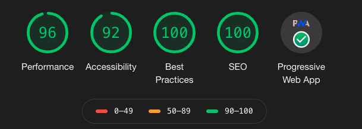

# AngularLand

This project was generated with [Angular CLI](https://github.com/angular/angular-cli) version 9.1.7.

## Development server

Run `ng serve` for a dev server. Navigate to `http://localhost:4200/`. The app will automatically reload if you change any of the source files.

## Development server:SSR

Run `npm run serve:ssr` for a SSR dev server. Navigate to `http://localhost:4000/`. The app will automatically reload if you change any of the source files.  ⚠️You'll have to comment the following code on the server.ts file `server.use(enforce.HTTPS({ trustProtoHeader: true }));`⚠️

## Build

Run `ng build` to build the project. The build artifacts will be stored in the `dist/` directory.

## Build:SSR

Run `npm run build:ssr` to build the project in SSR mode. The build artifacts will be stored in the `dist/` directory.

## Running unit tests

Run `ng test` to execute the unit tests via [Karma](https://karma-runner.github.io).

## Running end-to-end tests

Run `ng e2e` to execute the end-to-end tests via [Protractor](http://www.protractortest.org/).

## Lighthouse Score

